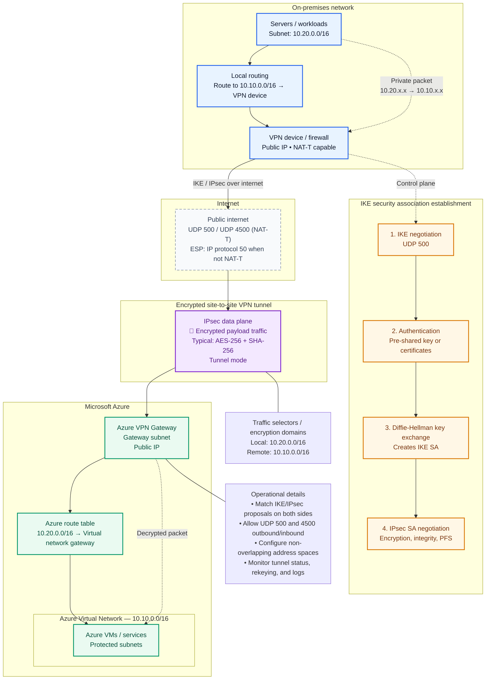

## Site to Site VPN Connection

Site-to-Site connection is essentially a secure VPN that spans between an on-premises VPN device and an Azure VPN Gateway which is located within your Azure GatewaySubnet.

This setup enables our on-premises network to send & receive data to & from a virtual network as of they were part of single large local network.

### Azure GatewaySubnet:
This subnet is a dedicated segment of our VNet, specifically reserved for hosting Azure Virtual Network Gateway & it forms the azure side of the site-to-site VPN connection.

Within the subnet sits the **Virtual Network Gateway (VPN Gateway)**. 

This critical piece of infrastructure is responsible for handling the encryption & decryption of data, maintaining the secure tunnel, and managing the cross-premises connectivity.

Within Azure, we have to create one more resource, which is called **local network gateway**.
**Local network gateway is used to reference our on-premises device IP address.** 

**On-Premises VPN Device :**
This device is a physical or virtual appliance that facilitates a VPN connection from our on-premises network to Azure.
It is configured to match the settings of the Azure VPN Gateway so that a secure tunnel can be established.

If my on prem device has an IP address of 13.12.11.11 , So in local network gateway, We'll tell that my on-premises device IP is 13.12.11.11.

Now when we set up site-to-site connection, I'll be referencing this local-network gateway  inside the connection which actually points to our on-premises device. 

### The components and their purpose :

| Component                                 | Where?                 | Purpose                                                                                                                      |
| ----------------------------------------- | ---------------------- | ---------------------------------------------------------------------------------------------------------------------------- |
| **Azure VNet**                            | Azure                  | The private network containing your Azure resources                                                                          |
| **GatewaySubnet**                         | Azure VNet             | Special subnet where the Azure VPN Gateway lives                                                                             |
| **Virtual Network Gateway / VPN Gateway** | Azure                  | Azure's VPN endpoint; establishes the encrypted tunnel                                                                       |
| **Public IP**                             | Azure                  | Public endpoint through which the VPN gateway communicates                                                                   |
| **Local Network Gateway**                 | Azure                  | **Logical representation of your on-premises network** — stores the on-prem VPN device's public IP and on-prem network CIDRs |
| **VPN Connection**                        | Azure                  | Joins the Azure VPN Gateway and Local Network Gateway; defines S2S/IPsec settings and shared key                             |
| **On-premises VPN Device**                | Your datacenter/office | The other endpoint of the VPN tunnel — firewall/router/VPN appliance                                                         |
| **On-prem Network**                       | Your datacenter/office | Private network containing your servers and applications                                                                     |
| **IPsec/IKE Tunnel**                      | Between both sites     | Encrypted tunnel carrying traffic between the two private networks                                                           |
| **BGP** _(optional)_                      | Both sides             | Dynamically exchanges routes instead of relying only on manually configured routes                                           |

Azure specifically requires a `GatewaySubnet` for the VPN gateway, while the Local Network Gateway represents the on-premises site and its address prefixes.

Local Network Gateway is not the physical VPN device.

![[Pasted image 20260819172901.png]]

## Security & VPN Terms:

| Term      | Full Form                      | Purpose                                              | Remember                             |
| --------- | ------------------------------ | ---------------------------------------------------- | ------------------------------------ |
| **VPN**   | Virtual Private Network        | Connects private networks securely over Internet     | Secure network connection            |
| **IPsec** | Internet Protocol Security     | Security framework for protecting IP traffic         | **Protects the traffic**             |
| **IKE**   | Internet Key Exchange          | Negotiates authentication, encryption and keys       | **Negotiates security**              |
| **IKEv1** | Internet Key Exchange v1       | Older IKE version                                    | Legacy                               |
| **IKEv2** | Internet Key Exchange v2       | Newer IKE version                                    | Modern/preferred in many deployments |
| **PSK**   | Pre-Shared Key                 | Shared secret used for authentication                | **Same secret on both sides**        |
| **ESP**   | Encapsulating Security Payload | Protects actual IP traffic                           | **Carries protected data**           |
| **AH**    | Authentication Header          | Provides authentication/integrity without encryption | Rarely used today                    |
| **SA**    | Security Association           | Stores negotiated security parameters                | **Security agreement**               |
| **NAT-T** | NAT Traversal                  | Allows IPsec to work through NAT                     | Usually UDP 4500                     |

## What Each Security Property Does: 

| Property           | Question it answers               | Example                               |
| ------------------ | --------------------------------- | ------------------------------------- |
| **Encryption**     | Can someone read my traffic?      | `Hello` → encrypted data              |
| **Authentication** | Who am I communicating with?      | Verify VPN peer using PSK/certificate |
| **Integrity**      | Was my packet modified?           | Detect packet tampering               |
| **Anti-replay**    | Is someone reusing an old packet? | Reject replayed packets               |

## IKE vs IPsec

|                 | IKE                                | IPsec                              |
| --------------- | ---------------------------------- | ---------------------------------- |
| Main job        | Negotiation                        | Protect traffic                    |
| Think of it as  | **Agreeing on the rules**          | **Applying the security**          |
| Handles         | Authentication, algorithms, keys   | Encryption/integrity of packets    |
| Common protocol | UDP 500 / 4500                     | ESP                                |
| Example         | "Let's use AES-256 and these keys" | Encrypt actual application traffic |

## IKE Phase 1 & Phase 2

|Phase|What happens|Result|
|---|---|---|
|**Phase 1**|VPN peers authenticate and negotiate security|**IKE SA**|
|**Phase 2**|Parameters for protecting actual traffic are negotiated|**IPsec/Child SA**|
|**After Phase 2**|Actual application/network traffic flows|Encrypted traffic|

## Important Protocols & Ports

| Protocol/Port            | Purpose                         | Remember                            |
| ------------------------ | ------------------------------- | ----------------------------------- |
| **UDP 500**              | IKE communication               | Initial VPN negotiation             |
| **UDP 4500**             | IKE/IPsec NAT-T                 | Used when NAT traversal is involved |
| **ESP (IP protocol 50)** | Carries protected IPsec traffic | **Not TCP/UDP port 50**             |
| **AH (IP protocol 51)**  | IPsec authentication/integrity  | Rarely used                         |

## Encryption & Algorithms

|Term|Purpose|Example|
|---|---|---|
|**Encryption algorithm**|Encrypts data|AES-256|
|**Integrity algorithm**|Detects modification|SHA-256|
|**Diffie-Hellman (DH)**|Helps establish shared secret material|DH Group 14, 19, etc.|
|**PFS**|Generates fresh keys for IPsec security associations|Additional key protection|
|**PSK**|Authenticates VPN peers|Shared secret|

## Routing Terms

| Term               | Purpose                                | Remember                           |
| ------------------ | -------------------------------------- | ---------------------------------- |
| **Route**          | Tells where traffic should go          | "Destination → next path"          |
| **Static Route**   | Manually configured route              | You specify the network            |
| **BGP**            | Dynamically exchanges routes           | Routers learn routes automatically |
| **Address Prefix** | Network range being advertised/reached | Example: `10.20.0.0/16`            |
| **Next Hop**       | Where the packet goes next             | Next destination on the path       |

