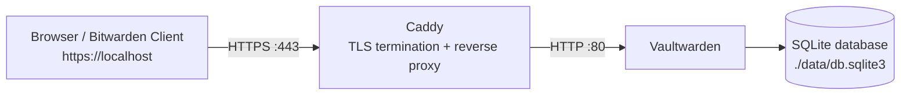

---

title: Self-Hosting Vaultwarden with Caddy (Local HTTPS)

aliases:

- Vaultwarden Local HTTPS

- Vaultwarden Caddy Docker Setup

tags:

- vaultwarden

- caddy

- docker

- https

- self-hosting

created: 2026-07-22

---

# Self-Hosting Vaultwarden with Caddy (Local HTTPS)

> [!goal] Goal

> Run **Vaultwarden** locally over **HTTPS**, with **Caddy** as the reverse proxy. This resolves the Bitwarden/Vaultwarden client message: `Insecure URL not allowed. All URLs must use HTTPS.`

## Architecture



> [!info] Why Caddy?

> Vaultwarden serves HTTP. Modern Bitwarden-compatible clients require HTTPS. Caddy handles TLS certificates and renewal, then forwards requests to Vaultwarden over HTTP. Vaultwarden itself never handles certificates.

## Project structure

```text

vault/

├── docker-compose.yml

├── Caddyfile

└── data/

```

## Docker Compose configuration

Create `docker-compose.yml`:

```yaml

services:

vaultwarden:

image: vaultwarden/server:latest

container_name: vaultwarden

restart: unless-stopped

environment:

DOMAIN: "https://localhost"

volumes:

- ./data:/data

expose:

- "80"

caddy:

image: caddy:2

container_name: caddy

restart: unless-stopped

ports:

- "80:80"

- "443:443"

volumes:

- ./Caddyfile:/etc/caddy/Caddyfile:ro

- caddy_data:/data

- caddy_config:/config

volumes:

caddy_data:

caddy_config:

```

## Caddy configuration

Create `Caddyfile`:

```caddy

localhost {

tls internal

reverse_proxy vaultwarden:80

}

```

> [!tip] `tls internal`

> This tells Caddy to create a local Certificate Authority (CA), generate a certificate for `localhost`, and serve Vaultwarden over HTTPS.

## Start and inspect the stack

```bash

docker compose up -d

docker ps -a

```