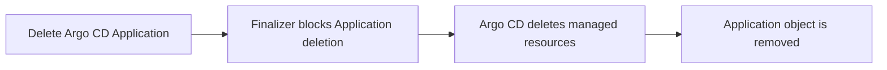
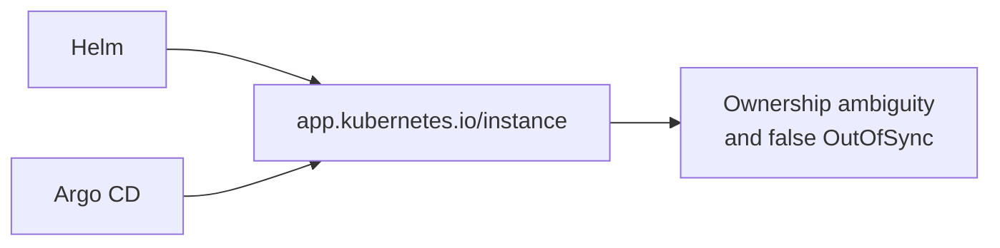
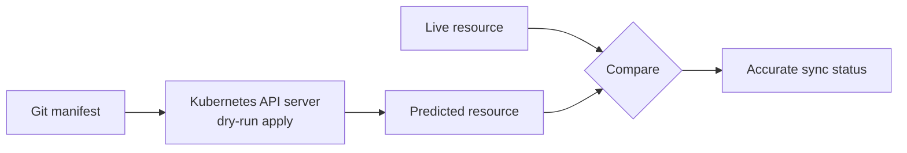
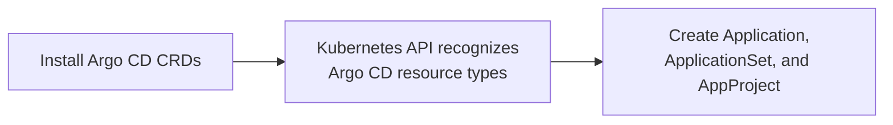

---

title: Argo CD — Finalizers, Resource Tracking, and Server-Side Diff

aliases:

- Argo CD Production Settings

tags:

- argocd

- gitops

- helm

- kubernetes

created: 2026-08-04

---
# Argo CD: Finalizers, Resource Tracking, and Server-Side Diff

## 1. Application finalizer

An Argo CD Application finalizer, usually `resources-finalizer.argocd.argoproj.io`, instructs Argo CD to remove the application's managed Kubernetes resources before the Application object itself is deleted.



> [!important]

> The finalizer provides **cascading deletion**: Deployments, Services, ConfigMaps, and other resources managed by the Application are cleaned up instead of being left behind.

## 2. Avoid Helm and Argo CD tracking conflicts

### The issue

Helm commonly tracks a release with:

```yaml

metadata:

labels:

app.kubernetes.io/instance: eso-config

app.kubernetes.io/managed-by: Helm

annotations:

meta.helm.sh/release-name: eso-config

meta.helm.sh/release-namespace: eso-ns

```

Argo CD's default tracking also uses the `app.kubernetes.io/instance` label. During a Helm-to-Argo-CD migration, two controllers can therefore modify the same tracking label.



### Recommended configuration

Use annotation-based resource tracking in Argo CD:

```yaml

configs:

cm:

application.resourceTrackingMethod: annotation

```

Argo CD will track resources with an annotation such as:

```yaml

metadata:

annotations:

argocd.argoproj.io/tracking-id: ...

```

| Tool | Tracking location |

| --- | --- |

| Helm | Labels and Helm ownership annotations |

| Argo CD | `argocd.argoproj.io/tracking-id` annotation |

> [!success]

> Annotation tracking prevents Argo CD from competing with Helm for `app.kubernetes.io/instance`. It is especially useful for migrations and clusters with multiple controllers.

## 3. Server-side diff

### What it does

Instead of Helm remembering everything,
the Kubernetes API Server now remembers field ownership.

That's a big architectural difference.
Server-side diff asks the Kubernetes API server to perform a dry-run apply of the Git manifest. Argo CD then compares that predicted resource with the actual live resource.



This accounts for API-server defaults and mutations, reducing noise from fields such as `resourceVersion`, `managedFields`, `uid`, `creationTimestamp`, and default values.

### Enable it

```yaml

configs:

params:

controller.diff.server.side: true

```

> [!tip] Best fit

> Enable server-side diff when managing existing resources, using Server-Side Apply, or operating alongside controllers such as ESO, cert-manager, Vault, or Istio.

## 4. Install Argo CD CRDs

Enable CRD installation in the Argo CD Helm chart:

```yaml

crds:

install: true

```

CRDs extend Kubernetes with Argo CD resource types, including:

- `Application`

- `ApplicationSet`

- `AppProject`

Without the CRDs, Kubernetes rejects these manifests with an error similar to:

```text

no matches for kind "Application" in version "argoproj.io/v1alpha1"

```



## Recommended Helm values

```yaml

crds:

install: true

configs:

cm:

application.resourceTrackingMethod: annotation

params:

controller.diff.server.side: true

```

## Summary

| Setting | Why it matters |

| --- | --- |

| Application finalizer | Cleans up Application-managed resources during deletion. |

| Annotation resource tracking | Avoids conflict with Helm's instance label. |

| Server-side diff | Produces a more accurate diff and fewer false `OutOfSync` states. |

| `crds.install: true` | Ensures Kubernetes recognizes Argo CD custom resources. |