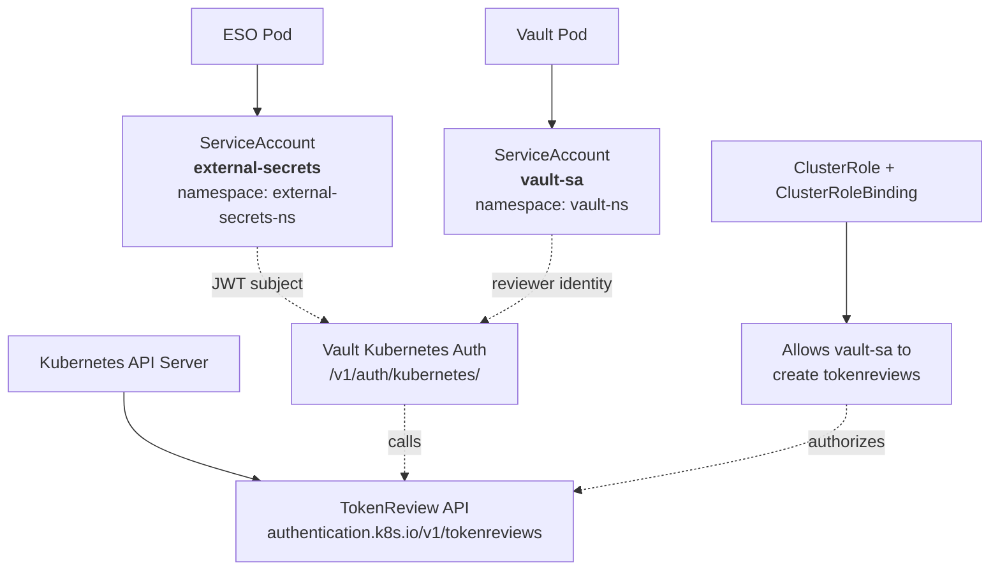
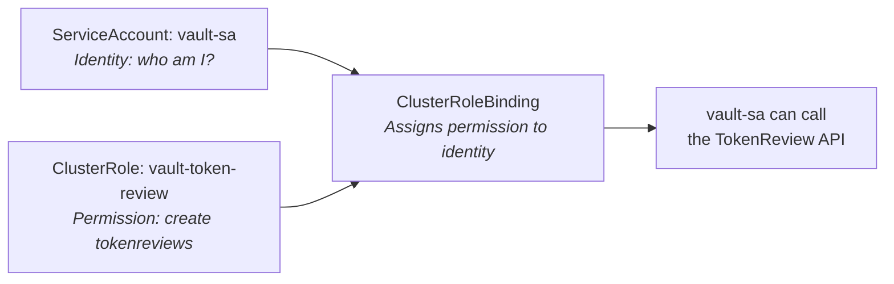
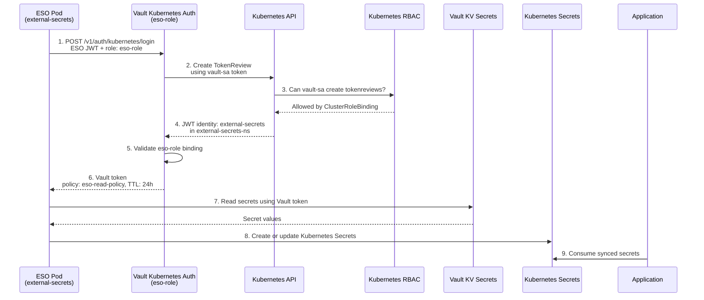
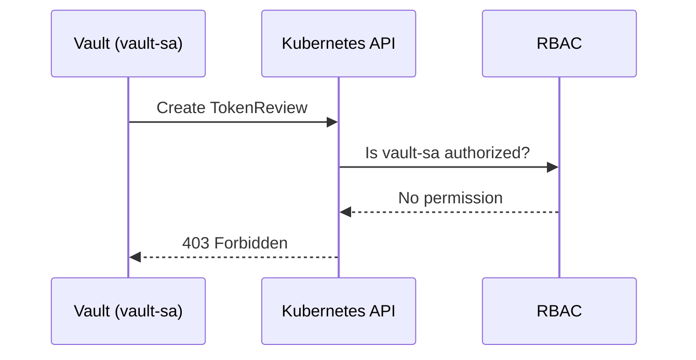
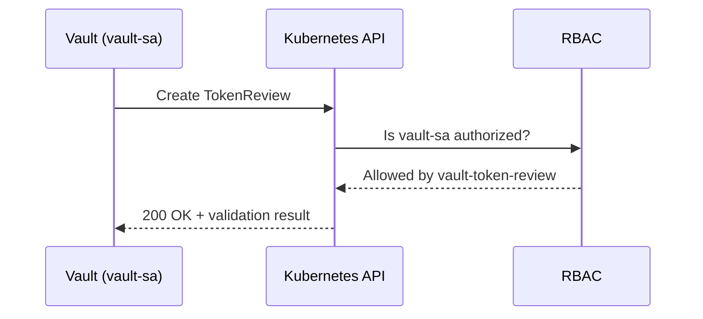

---

title: ESO + HashiCorp Vault Integration Troubleshooting

aliases:

- ESO Vault Kubernetes Auth Troubleshooting

tags:

- kubernetes

- vault

- external-secrets

- troubleshooting

created: 2026-07-17

---
---
ESO + HashiCorp Vault — Complete Kubernetes Authentication Flow

aliases:

- ESO Vault Authentication Flow

- Vault TokenReview RBAC

tags:

- kubernetes

- vault

- external-secrets

- rbac

created: 2026-07-19

---

  

# ESO + HashiCorp Vault: Complete Flow

  

> [!abstract] Overview

> This note explains how External Secrets Operator (ESO), Vault, Kubernetes service accounts, and RBAC work together—and why Vault needs a `ClusterRole` and `ClusterRoleBinding` even though it already has a service account.

  

## Components

  



  

| Component | Service account | Responsibility |

| --- | --- | --- |

| ESO pod | `external-secrets` in `external-secrets-ns` | Presents its JWT to Vault |

| Vault pod | `vault-sa` in `vault-ns` | Calls the Kubernetes TokenReview API |

| Kubernetes API server | N/A | Validates the ESO JWT |

| Vault Kubernetes auth | N/A | Authenticates ESO and issues a Vault token |

| RBAC | N/A | Allows `vault-sa` to create TokenReview requests |

  

## The core concept: identity vs. permission

  

> [!important] A ServiceAccount is not a permission grant

> - A **ServiceAccount** answers: **Who am I?**

> - A **ClusterRole** answers: **What actions are allowed?**

> - A **ClusterRoleBinding** answers: **Which identity gets those actions?**

>

> `vault-sa` needs all three pieces so it can authenticate to the Kubernetes API **and** call the TokenReview API.

  



  

## Full authentication and secret-sync flow

  



  

### Flow details

  

1. **ESO reads its Kubernetes JWT** from `/var/run/secrets/kubernetes.io/serviceaccount/token`. The token identifies `external-secrets`.

2. **ESO logs into Vault** at `POST /v1/auth/kubernetes/login`, passing that JWT and the role `eso-role`.

3. **Vault validates the JWT** by creating a `TokenReview` request against the Kubernetes API, using **Vault's** `vault-sa` token.

4. **Kubernetes RBAC authorizes Vault**. The API confirms `vault-sa` may `create` `tokenreviews`.

5. **Kubernetes returns ESO's identity** to Vault: service account `external-secrets` in `external-secrets-ns`.

6. **Vault checks role mapping**. `eso-role` must allow that service account and namespace; Vault then returns a Vault token with `eso-read-policy` and a 24-hour TTL.

7. **ESO reads Vault KV secrets** using its Vault token.

8. **ESO creates or updates Kubernetes Secrets**, such as `student-db-url-secret`, `postgres-db-secret`, and `dockerhub-secret`.

9. **Applications consume the Kubernetes Secrets** through environment variables, volume mounts, or image-pull configuration.

  

## Why RBAC is required

  

### Without RBAC

  



  

> [!failure] Result

> Vault cannot validate ESO's JWT, so ESO cannot authenticate or synchronize secrets.

  

### With RBAC

  



  

> [!success] Result

> Vault validates ESO's JWT, issues a Vault token, and ESO can synchronize Vault secrets to Kubernetes.

  

## Required configuration

  

### Service accounts

  

```bash

# ESO's service account

kubectl create sa external-secrets -n external-secrets-ns

  

# Vault's service account, if it does not already exist

kubectl create sa vault-sa -n vault-ns

```

  

### RBAC: allow Vault to create TokenReviews

  

```yaml

apiVersion: rbac.authorization.k8s.io/v1

kind: ClusterRole

metadata:

name: vault-token-review

rules:

- apiGroups: ["authentication.k8s.io"]

resources: ["tokenreviews"]

verbs: ["create"]

---

apiVersion: rbac.authorization.k8s.io/v1

kind: ClusterRoleBinding

metadata:

name: vault-token-review

subjects:

- kind: ServiceAccount

name: vault-sa

namespace: vault-ns

roleRef:

kind: ClusterRole

name: vault-token-review

apiGroup: rbac.authorization.k8s.io

```

  

```bash

# Confirm the effective permission.

kubectl auth can-i create tokenreviews --as=system:serviceaccount:vault-ns:vault-sa

# Expected: yes

```

  

> [!note]

> `tokenreviews` is cluster-scoped; use a `ClusterRole` and `ClusterRoleBinding`, not namespace-scoped Role resources.

  

### Configure Vault Kubernetes auth

  

```bash

# Enable the auth method once.

kubectl exec -it vault-0 -n vault-ns -- vault auth enable kubernetes

  

# Configure it using Vault's mounted service-account token.

kubectl exec -it vault-0 -n vault-ns -- sh -c '

VAULT_TOKEN=$(cat /var/run/secrets/kubernetes.io/serviceaccount/token)

vault write auth/kubernetes/config \

kubernetes_host="https://kubernetes.default.svc.cluster.local:443" \

kubernetes_ca_cert=@/var/run/secrets/kubernetes.io/serviceaccount/ca.crt \

token_reviewer_jwt="$VAULT_TOKEN" \

disable_iss_validation=true

'

```

  

### Create the Vault role

  

```bash

kubectl exec -it vault-0 -n vault-ns -- vault write auth/kubernetes/role/eso-role \

bound_service_account_names=external-secrets \

bound_service_account_namespaces=external-secrets-ns \

policies=eso-read-policy \

ttl=24h

```

  

### Create the ClusterSecretStore

  

```yaml

apiVersion: external-secrets.io/v1

kind: ClusterSecretStore

metadata:

name: vault-one2n-store

spec:

provider:

vault:

server: "http://vault-svc.vault-ns.svc.cluster.local:8200"

path: "secret"

version: "v2"

auth:

kubernetes:

mountPath: "kubernetes"

role: "eso-role"

serviceAccountRef:

name: "external-secrets"

namespace: "external-secrets-ns"

```

  

## Verification checklist

  

```bash

# RBAC

kubectl auth can-i create tokenreviews --as=system:serviceaccount:vault-ns:vault-sa

  

# Vault configuration and role

kubectl exec -it vault-0 -n vault-ns -- vault read auth/kubernetes/config

kubectl exec -it vault-0 -n vault-ns -- vault read auth/kubernetes/role/eso-role

  

# ESO resources and resulting secrets

kubectl get clustersecretstore vault-one2n-store

kubectl get externalsecret -n student-api

kubectl get secret -n student-api

```

  

## Golden rule

  

> [!quote]

> **ServiceAccount = who you are.**

> **ClusterRoleBinding = what you are allowed to do.**

  

| Component | Identity | Required RBAC | Why |

| --- | --- | --- | --- |

| ESO | `external-secrets` | No TokenReview permission needed | It is the subject being authenticated. |

| Vault | `vault-sa` | `create` on `tokenreviews` | It performs the validation. |

  

> [!example] Analogy

> - **ESO** is a student showing an ID card.

> - **Vault** is a security guard checking the ID.

> - **RBAC** is the guard's authorization to check IDs.

>

> The student only needs to present their ID. The guard needs explicit permission to validate it.