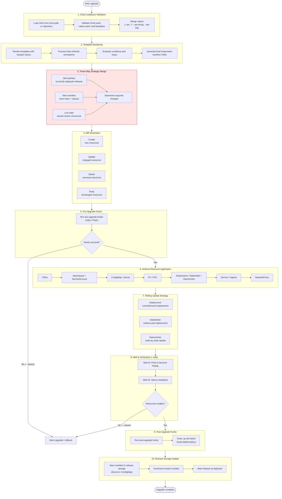

Helm is a package manager for k8s. 

Helm uses a packaging format called _charts_. A chart is a collection of files that describe a related set of Kubernetes resources. A single chart might be used to deploy something simple, like a memcached pod, or something complex, like a full web app stack with HTTP servers, databases, caches, and so on.

Inside of this directory, Helm will expect a structure that matches this:

```
wordpress/  Chart.yaml          # A YAML file containing information about
the chart  LICENSE             # OPTIONAL: A plain text file containing the license for the chart  README.md           # OPTIONAL: A human-readable README file  values.yaml         # The default configuration values for this chart  values.schema.json  # OPTIONAL: A JSON Schema for imposing a structure on the values.yaml file  charts/             # A directory containing any charts upon which this chart depends.  crds/               # Custom Resource Definitions  templates/          # A directory of templates that, when combined with values,                      # will generate valid Kubernetes manifest files.  templates/NOTES.txt # OPTIONAL: A plain text file containing short usage notes
```

Helm Chart Hook : Even before our app gets up with helm , db can be backed up. So this is single chart hook usecase.

To create a initial basic skeleton for working with helm.
```
helm create /root/webapp-nginx
```

Each time we create a new release of same app, if our deployment name is nginx-deployment set in values.yml then we are not able to create new release as the deployment name is already been created earlier. 
For this we templatize the name of deployment.
```bash
name: {{ .Release.Name }}-nginx
```

To verify that the chart is correctly defined, we can also use this command:
```bash
helm lint ./nginx
```

Before actually installing this, we can do what is called a **dry run**. This **pretends** to install the package to the cluster, and it can catch things that Kubernetes would complain about in a real install.
```bash
helm install sre-1 ./student-api --dry-run
```


**Single Chart Problem:**
- Can't upgrade components independently
- Staging might need new API but old Vault

**Multiple Charts Solution:**
- Each component can have its own version matrix
- Canary deployments per component

