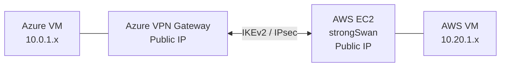
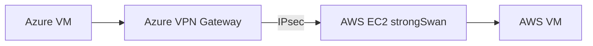

---

title: Azure ↔ AWS Site-to-Site VPN — Setup Guide

tags:

- azure

- aws

- vpn

- ipsec

- strongswan

---


# Azure ↔ AWS Site-to-Site VPN Setup Guide

This guide builds a static-route Site-to-Site IPsec VPN using an **Azure VPN Gateway** and an **AWS EC2 instance running strongSwan**.



## Network plan

- Azure VNet: `10.0.0.0/16`
- Azure application subnet: `10.0.1.0/24`
- Azure gateway subnet: `10.0.255.0/27`
- AWS VPC: `10.20.0.0/16`
- AWS VPN subnet: `10.20.1.0/24`

> [!important]
> The Azure and AWS CIDRs must not overlap. Routing is ambiguous when both networks use the same address range.

## 1. Create the Azure resources

1. Create a VNet: `10.0.0.0/16`.
2. Create the application subnet: `10.0.1.0/24`.
3. Create a subnet named **exactly** `GatewaySubnet`: `10.0.255.0/27`.
4. Create a Standard public IP for the gateway.
5. Create a route-based Azure VPN Gateway.

Example gateway settings:

```text
Name: kk-vpn-gateway
Gateway type: VPN
VPN type: Route-based
SKU: VpnGw1AZ
BGP: Disabled
```

> [!note]
> The Azure VPN Gateway is the Azure-side VPN endpoint. It is not the tunnel itself.

## 2. Create the AWS resources

1. Create a VPC: `10.20.0.0/16`.
2. Create a subnet: `10.20.1.0/24`.
3. Attach an Internet Gateway and ensure the subnet route table has `0.0.0.0/0` pointing to it.
4. Launch an Ubuntu EC2 instance in that subnet with a public IP. This instance is the VPN endpoint.

### Security group rules

- TCP `22` from your public IP only — SSH administration
- UDP `500` — IKE
- UDP `4500` — NAT Traversal (NAT-T)
- ESP (IP protocol `50`) — IPsec traffic when not encapsulated in NAT-T

## 3. Prepare the AWS VPN EC2 instance

### Disable Source/Destination Check

In the EC2 console:

```text
EC2 → Networking → Change source/destination check → Disable
```

The EC2 instance is acting as a router, so it must be allowed to forward traffic that is not addressed to itself.

### Enable IP forwarding

```bash
sudo sysctl -w net.ipv4.ip_forward=1
echo "net.ipv4.ip_forward = 1" | sudo tee -a /etc/sysctl.conf
sudo sysctl -p
sysctl net.ipv4.ip_forward
```

Expected:

```text
net.ipv4.ip_forward = 1
```

### Install strongSwan

```bash
sudo apt update
sudo apt install -y strongswan strongswan-starter
ipsec version
```

## 4. Create the Azure Local Network Gateway

Create an Azure **Local Network Gateway** with:

```text
Remote VPN public IP: <AWS_EC2_PUBLIC_IP>
Remote address space: 10.20.0.0/16
```

This Azure resource represents the AWS VPN endpoint and the AWS network behind it.

## 5. Create the Azure VPN connection

On `kk-vpn-gateway`, create a connection using:

```text
Name: azure-to-aws
Connection type: Site-to-site (IPSec)
Local Network Gateway: the AWS Local Network Gateway
Shared key (PSK): <YOUR_SHARED_KEY>
IKE protocol: IKEv2
```

The same PSK must be configured on strongSwan.

## 6. Configure strongSwan

Edit `/etc/ipsec.conf`:

```conf
config setup
    charondebug="ike 2, knl 2, cfg 2"

conn azure-vpn
    type=tunnel
    auto=start
    keyexchange=ikev2
    authby=psk

    left=%defaultroute
    leftid=<AWS_EC2_PUBLIC_IP>
    right=<AZURE_VPN_GATEWAY_PUBLIC_IP>
    rightid=%any

    ike=aes256-sha256-modp2048
    esp=aes256-sha256

    dpdaction=restart
    dpddelay=30s
    dpdtimeout=120s
    keyingtries=%forever

    leftsubnet=10.20.0.0/16
    rightsubnet=10.0.0.0/16
```

In this configuration:

- `left` — AWS / strongSwan side
- `right` — Azure side
- `leftsubnet` — AWS VPC CIDR
- `rightsubnet` — Azure VNet CIDR

Edit `/etc/ipsec.secrets`:

```text
<AWS_EC2_PUBLIC_IP> <AZURE_VPN_GATEWAY_PUBLIC_IP> : PSK "YOUR_SHARED_KEY"
```

> [!warning]
> The PSK, IKE proposal, ESP proposal, and traffic selectors must match the Azure VPN connection. A mismatch prevents the tunnel from coming up.

## 7. Start and verify the tunnel

```bash
sudo systemctl restart strongswan
sudo ipsec up azure-vpn
sudo ipsec statusall
```

Expected indicators:

```text
IKE_SA established
CHILD_SA established
```

- `IKE_SA` — The VPN endpoints authenticated and negotiated security.
- `CHILD_SA` — IPsec is ready to protect application traffic.

## 8. Configure routing

A tunnel being up is not enough. Both networks must route traffic to the VPN endpoint.



- Azure learns `10.20.0.0/16` from the Local Network Gateway address space.
- In AWS, add a VPC route for `10.0.0.0/16` with the **VPN EC2 instance / ENI** as the target.
- Ensure Azure NSGs, AWS security groups, and host firewalls allow the application traffic you want to test.

## 9. Test and troubleshoot

Test private connectivity from an Azure VM to an AWS VM, for example:

```bash
ping <AWS_PRIVATE_IP>
```

Useful AWS VPN checks:

```bash
sudo ipsec statusall
sudo journalctl -u strongswan --no-pager -n 100
ip route
ip xfrm state
ip xfrm policy
sudo tcpdump -ni any 'udp port 500 or udp port 4500 or proto 50'
```

### Troubleshooting checks

- **IKE does not start** — Check public IPs, Internet routing, UDP `500`/`4500`, security groups, and Azure NSG.
- **PSK authentication fails** — Check the shared key in Azure and `/etc/ipsec.secrets`.
- **`NO_PROPOSAL_CHOSEN`** — Compare the Azure IKE/IPsec policy with strongSwan `ike` and `esp` values.
- **`IKE_SA` and `CHILD_SA` are up but ping fails** — Check the AWS route table, Source/Destination Check, IP forwarding, NSGs/security groups, and host firewall.

## Final mental model

> [!summary]
> - **IKEv2** authenticates the VPN peers and establishes keys.
> - **IPsec/ESP** protects the actual private network traffic.
> - **Azure VPN Gateway** and **strongSwan** are the endpoints.
> - **Routing** decides whether private traffic reaches those endpoints.
