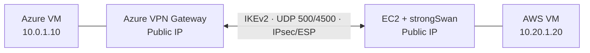
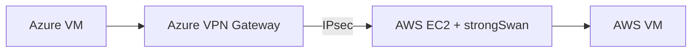

---

title: Azure ↔ AWS Site-to-Site VPN — Setup Guide

tags:

- azure

- aws

- vpn

- ipsec

- strongswan

---
# Azure ↔ AWS Site-to-Site VPN

> [!abstract] Objective
> Connect an Azure VNet to an AWS VPC through a secure **Site-to-Site IPsec VPN**. Azure uses a managed **VPN Gateway**, while AWS uses an EC2 instance running **strongSwan**.

## Architecture



> [!important]
> Azure and AWS CIDR ranges must **not overlap**. Use `10.0.0.0/16` for Azure and `10.20.0.0/16` for AWS.

## Key concepts

- **VPN Gateway** — Azure-managed VPN endpoint.
- **strongSwan** — Linux IPsec implementation running on AWS EC2.
- **IKEv2** — Negotiates security parameters and authenticates peers.
- **PSK** — Shared secret used to authenticate both endpoints.
- **IKE SA** — Secure control relationship between VPN peers.
- **CHILD SA** — IPsec security association that carries traffic.
- **IPsec / ESP** — Encrypts and protects private network traffic.
- **Routing** — Sends traffic to the correct VPN endpoint.

> [!tip] Mental model
> **IKE establishes the secure relationship.**  
> **IPsec/ESP protects the actual traffic.**  
> **Routing decides where the traffic goes.**

## Network design

### Azure

- VNet: `vnet-dq` — `10.0.0.0/16`
- Application subnet: `10.0.1.0/24`
- Gateway subnet: `GatewaySubnet` — `10.0.255.0/27`
- VPN Gateway: `kk-vpn-gateway`
- VPN type: Route-based
- SKU: `VpnGw1AZ`
- BGP: Disabled

> [!warning]
> `GatewaySubnet` is reserved for Azure gateway resources. Do not deploy normal VMs into it.

### AWS

- VPC: `aws-vpn-vpc` — `10.20.0.0/16`
- VPN subnet: `10.20.1.0/24`
- VPN appliance: Ubuntu EC2 running strongSwan
- Example private IP: `10.20.1.9`
- Internet access: Internet Gateway with a `0.0.0.0/0` route

## Azure setup

### 1. Create the VNet and subnets

```text
VNet: vnet-dq
Address space: 10.0.0.0/16

Application subnet
Name: app-subnet
CIDR: 10.0.1.0/24

Gateway subnet
Name: GatewaySubnet
CIDR: 10.0.255.0/27
```

### 2. Create the VPN Gateway

```text
Name: kk-vpn-gateway
Gateway type: VPN
VPN type: Route-based
SKU: VpnGw1AZ
Generation: Generation1
BGP: Disabled
Public IP: vpn-gateway-pip
```

```bash
az network vnet-gateway create \
  --resource-group <RESOURCE_GROUP> \
  --name kk-vpn-gateway \
  --location eastus \
  --gateway-type Vpn \
  --vpn-type RouteBased \
  --sku VpnGw1AZ \
  --vpn-gateway-generation Generation1 \
  --vnet vnet-dq \
  --public-ip-addresses vpn-gateway-pip
```

### 3. Create the Local Network Gateway

```text
Name: aws-local-gateway
Remote VPN public IP: <AWS_EC2_PUBLIC_IP>
Remote address space: 10.20.0.0/16
BGP: Disabled
```

The Local Network Gateway represents the AWS VPN endpoint and the AWS network behind it.

### 4. Create the VPN connection

```text
Name: azure-to-aws
Connection type: Site-to-site (IPsec)
Virtual network gateway: kk-vpn-gateway
Local network gateway: aws-local-gateway
IKE version: IKEv2
BGP: Disabled
Shared key: <YOUR_PSK>
```

> [!danger]
> Use a strong PSK and never store it in Git, public notes, or screenshots.

## AWS setup

### 1. Create the VPC and subnet

```text
VPC: aws-vpn-vpc
CIDR: 10.20.0.0/16

Subnet: vpn-subnet
CIDR: 10.20.1.0/24
```

Attach an Internet Gateway and add this route:

```text
Destination: 0.0.0.0/0
Target: Internet Gateway
```

### 2. Launch the VPN EC2 instance

```text
OS: Ubuntu Server LTS
Name: aws-vpn-server
Subnet: vpn-subnet
Public IP: Enabled
```

### 3. Configure the Security Group

- TCP `22` — SSH; allow only your public IP.
- UDP `500` — IKE.
- UDP `4500` — NAT Traversal.
- ESP, IP protocol `50` — IPsec ESP when NAT-T is not used.

> [!important]
> IKE uses **UDP 500**. NAT Traversal uses **UDP 4500**. They are not TCP ports.

### 4. Allow packet forwarding

Disable **Source/Destination Check** on the VPN EC2 instance. The instance must forward packets destined for Azure and AWS workloads, not only packets addressed to itself.

Enable Linux IP forwarding:

```bash
sudo sysctl -w net.ipv4.ip_forward=1
echo 'net.ipv4.ip_forward = 1' | sudo tee -a /etc/sysctl.conf
sudo sysctl -p
sysctl net.ipv4.ip_forward
```

Expected:

```text
net.ipv4.ip_forward = 1
```

## Install and configure strongSwan

### Install

```bash
sudo apt update
sudo apt install -y strongswan strongswan-starter
ipsec version
```

### Configure `/etc/ipsec.conf`

```conf
config setup
    charondebug="ike 2, knl 2, cfg 2"

conn azure-vpn
    type=tunnel
    auto=start
    keyexchange=ikev2
    authby=psk

    left=%defaultroute
    leftid=<AWS_EC2_PUBLIC_IP>
    leftsubnet=10.20.0.0/16

    right=<AZURE_VPN_GATEWAY_PUBLIC_IP>
    rightid=%any
    rightsubnet=10.0.0.0/16

    ike=aes256-sha256-modp2048
    esp=aes256-sha256

    dpdaction=restart
    dpddelay=30s
    dpdtimeout=120s
    keyingtries=%forever
```

### Configure `/etc/ipsec.secrets`

```conf
<AWS_EC2_PUBLIC_IP> <AZURE_VPN_GATEWAY_PUBLIC_IP> : PSK "<YOUR_SHARED_KEY>"
```

> [!note]
> `left` is the AWS strongSwan side; `right` is the Azure side.

### Start the tunnel

```bash
sudo systemctl restart strongswan
sudo ipsec up azure-vpn
sudo ipsec statusall
```

Successful output should include:

```text
IKE_SA established
CHILD_SA established
```

## Routing requirements



- Azure destination: `10.20.0.0/16` → Azure VPN connection.
- AWS workload route table: `10.0.0.0/16` → VPN EC2 instance or its ENI.

> [!warning]
> A tunnel being **UP** does not prove application connectivity. Routing, security groups, NSGs, host firewalls, IP forwarding, and EC2 Source/Destination Check must also be correct.

## Troubleshooting

```bash
sudo systemctl status strongswan
sudo ipsec statusall
sudo journalctl -u strongswan --no-pager -n 100
ip route
sysctl net.ipv4.ip_forward
ip xfrm state
ip xfrm policy
sudo tcpdump -ni any 'udp port 500 or udp port 4500 or proto 50'
```

- **`NO_PROPOSAL_CHOSEN`** — Compare the Azure IPsec/IKE policy with `ike=` and `esp=`.
- **IKE authentication failure** — Check Azure shared key, `/etc/ipsec.secrets`, and `leftid`.
- **No IKE activity** — Check UDP `500`/`4500`, security group, Azure NSG, public IPs, and Internet routing.
- **IKE SA works but no CHILD SA** — Check `leftsubnet`, `rightsubnet`, and ESP settings.
- **Tunnel is UP but ping fails** — Check route tables, Source/Destination Check, IP forwarding, security groups/NSGs, and host firewalls.

> [!summary] Final takeaway
> A cross-cloud Site-to-Site VPN needs three things to work together:
>
> 1. **A healthy IKE/IPsec tunnel**
> 2. **Correct routes on both sides**
> 3. **Forwarding and firewall rules that allow workload traffic**
