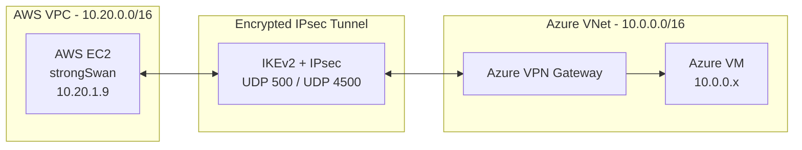
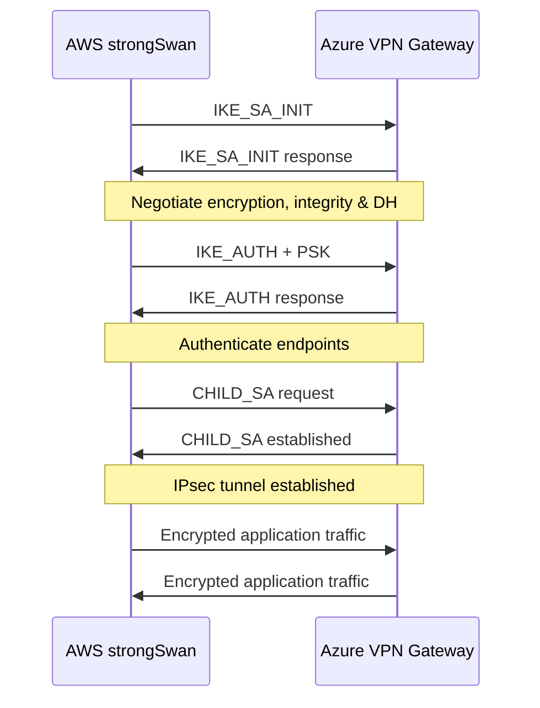
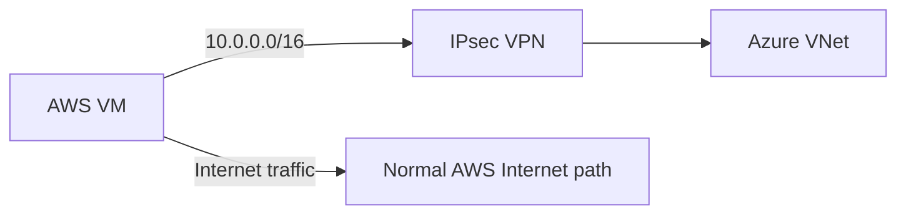
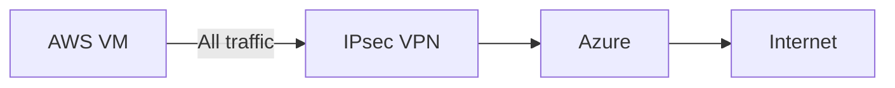
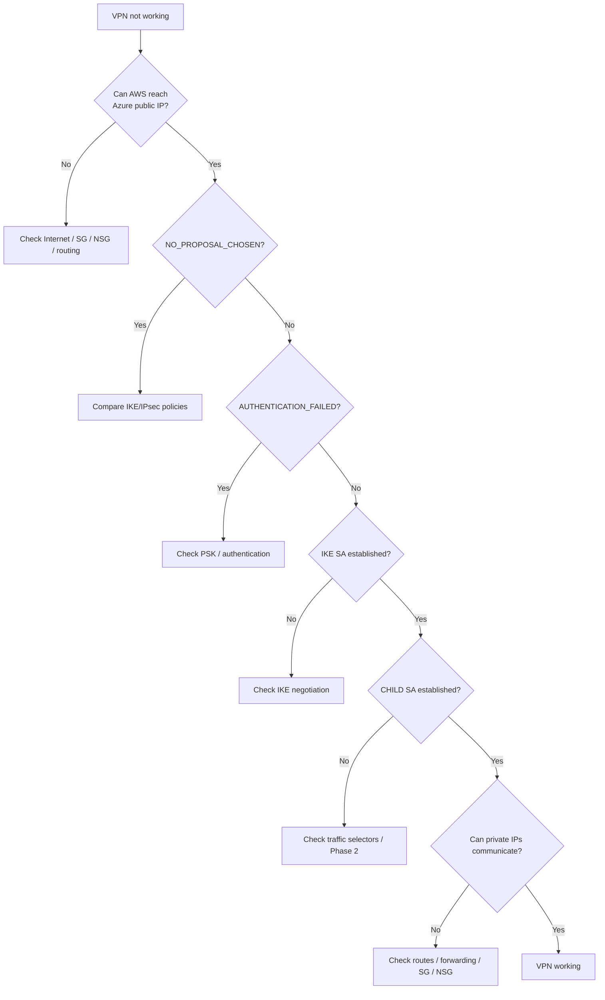
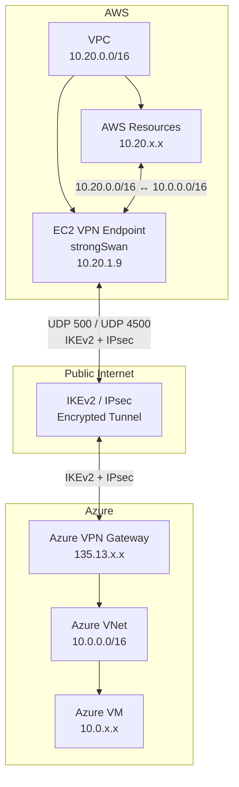

---

title: Azure ↔ AWS Site-to-Site VPN — Setup Guide

tags:

- azure

- aws

- vpn

- ipsec

- strongswan

---
# AWS ↔ Azure Site-to-Site VPN 
## 1. Overview

A **Site-to-Site VPN** creates a secure IPsec tunnel between two private networks.

In this lab:

- **AWS** acts as one side of the VPN.
- **Azure** acts as the other side.
- An **AWS EC2 instance running strongSwan** acts as the VPN endpoint on the AWS side.
- **Azure VPN Gateway** acts as the VPN endpoint on the Azure side.
- The VPN uses **IKEv2 + IPsec + Pre-Shared Key (PSK)**.
- The tunnel is **bidirectional**.
- The tunnel is currently configured as a **split tunnel**.

### Lab topology

````

````

---

# 2. What Are We Building?

The goal is:

```
AWS VPC                         Azure VNet
10.20.0.0/16                    10.0.0.0/16
     │                               │
     │                               │
     └─────── IPsec VPN ─────────────┘
```

A VM in AWS should be able to communicate with a VM/resource in Azure using their **private IP addresses**.

For example:

```
AWS VM
10.20.1.9

       │
       │ IPsec VPN
       ▼

Azure VM
10.0.0.4
```

---

# 3. Important Concepts

Before configuring the VPN, understand these concepts.

|Concept|Simple meaning|
|---|---|
|**VPN**|Creates a private connection over an untrusted network|
|**Site-to-Site VPN**|Connects two networks rather than individual users|
|**IPsec**|Protocol suite used to secure IP traffic|
|**IKE**|Protocol used to establish and authenticate the VPN|
|**IKEv2**|Modern version of IKE|
|**PSK**|Shared secret used to authenticate both VPN endpoints|
|**ESP**|IPsec protocol that encrypts/authenticates traffic|
|**Tunnel**|Logical secure path between the two networks|
|**Traffic Selector**|Defines which traffic is allowed through the VPN|
|**DH Group**|Used to establish shared cryptographic keys|
|**PFS**|Generates new keys for IPsec sessions|
|**NAT-T**|Allows IPsec to work through NAT|
|**strongSwan**|Open-source IPsec VPN implementation|

---

# 4. IKE vs IPsec

This is one of the most important things to understand.

## IKE

**IKE = Internet Key Exchange**

IKE is responsible for establishing the secure relationship between the two VPN endpoints.

Think:

> **"Who are you, and how are we going to securely communicate?"**

IKE handles things such as:

- Authentication
- Negotiating encryption algorithms
- Negotiating integrity algorithms
- Diffie-Hellman key exchange
- Establishing the IKE Security Association

In our lab:

```
AWS strongSwan
      │
      │ IKEv2
      ▼
Azure VPN Gateway
```

---

## IPsec

Once IKE has established the relationship, **IPsec protects the actual network traffic**.

Think:

> **"Now that we trust each other, let's securely transport the data."**

IPsec provides:

- Encryption
- Integrity
- Authentication of packets
- Anti-replay protection

Our tunnel uses **ESP** for the actual IPsec traffic.

---

# 5. IKE Phase 1 and Phase 2

A useful mental model:

```
Phase 1
   │
   │ Establish secure relationship
   ▼
IKE SA
   │
   │
   ▼
Phase 2
   │
   │ Establish IPsec tunnel
   ▼
CHILD SA
   │
   ▼
Encrypted data
```

## Phase 1 — IKE SA

The two VPN endpoints negotiate:

- Encryption
- Integrity/PRF
- Diffie-Hellman group
- Authentication

Our lab:

```
Encryption: AES256
Integrity/PRF: SHA256
DH Group: DHGroup14
Protocol: IKEv2
Authentication: PSK
```

---

## Phase 2 — CHILD SA / IPsec SA

The endpoints negotiate how the actual traffic will be protected.

Our lab:

```
Encryption: AES256
Integrity: SHA256
PFS: None
```

The traffic selectors are:

```
AWS:    10.20.0.0/16
Azure:  10.0.0.0/16
```

Therefore:

```
10.20.0.0/16  <──── IPsec ────>  10.0.0.0/16
```

---

# 6. Our Final VPN Configuration

## AWS

### VPC

```
10.20.0.0/16
```

### VPN endpoint

AWS EC2 running:

```
strongSwan 6.0.4
```

### EC2 private IP

```
10.20.1.9
```

### EC2 public IP

```
3.238.158.188
```

> Use your actual public IP if it changes. An Elastic IP is preferable for a persistent lab.

---

## Azure

### VNet

```
10.0.0.0/16
```

### VPN Gateway

```
Azure VPN Gateway
```

### Azure VPN Gateway public IP

```
135.13.176.217
```

> The actual public IP can be different in another deployment.

---

# 7. VPN Parameters

The two sides must agree on the cryptographic parameters.

|Parameter|Azure|strongSwan|
|---|---|---|
|IKE|IKEv2|`keyexchange=ikev2`|
|Authentication|PSK|`authby=psk`|
|IKE Encryption|AES256|`aes256`|
|IKE Integrity/PRF|SHA256|`sha256`|
|DH Group|DHGroup14|`modp2048`|
|IPsec Encryption|AES256|`aes256`|
|IPsec Integrity|SHA256|`sha256`|
|PFS|None|No DH group in `esp`|
|AWS network|`10.20.0.0/16`|`leftsubnet`|
|Azure network|`10.0.0.0/16`|`rightsubnet`|

---

# 8. strongSwan Configuration

## `/etc/ipsec.conf`

```
config setup
    charondebug="ike 2, knl 2, cfg 2"

conn azure-vpn
    type=tunnel
    keyexchange=ikev2
    authby=psk

    left=%defaultroute
    leftid=3.238.158.188
    leftsubnet=10.20.0.0/16

    right=135.13.176.217
    rightsubnet=10.0.0.0/16

    # IKE Phase 1
    ike=aes256-sha256-modp2048!

    # IPsec Phase 2
    # No PFS
    esp=aes256-sha256!

    dpdaction=restart
    dpddelay=30s
    dpdtimeout=120s

    keyingtries=%forever

    auto=start
```

---

# 9. Understanding the strongSwan Configuration

## `keyexchange=ikev2`

```
keyexchange=ikev2
```

Use IKE version 2.

---

## `authby=psk`

```
authby=psk
```

Authenticate the VPN endpoints using a **Pre-Shared Key**.

---

## `left`

```
left=%defaultroute
```

`left` represents the **local VPN endpoint** — our AWS strongSwan machine.

---

## `leftid`

```
leftid=3.238.158.188
```

The identity presented by the AWS VPN endpoint.

---

## `leftsubnet`

```
leftsubnet=10.20.0.0/16
```

The AWS network that should participate in the VPN.

---

## `right`

```
right=135.13.176.217
```

The public IP address of the Azure VPN Gateway.

---

## `rightsubnet`

```
rightsubnet=10.0.0.0/16
```

The Azure network that should participate in the VPN.

---

# 10. Understanding the IKE Proposal

```
ike=aes256-sha256-modp2048!
```

Break it down:

```
aes256
   │
   └── Encryption

sha256
   │
   └── Integrity / PRF

modp2048
   │
   └── Diffie-Hellman Group 14
```

The `!` means:

> Use only this proposal.

This is useful when troubleshooting because strongSwan won't try alternative proposals.

---

# 11. Understanding the IPsec Proposal

```
esp=aes256-sha256!
```

Means:

```
AES256
  +
SHA256
  +
No PFS
```

Because PFS is disabled, we don't specify another DH group here.

---

# 12. PSK Configuration

File:

```
/etc/ipsec.secrets
```

Example:

```
: PSK "AzureAWS-VPN-Lab-2026-StrongKey!"
```

The same PSK must exist on the Azure side.

Think:

```
AWS strongSwan
      │
      │ Same PSK
      │
      ▼
Azure VPN Gateway
```

If the PSKs don't match:

```
AUTHENTICATION_FAILED
```

---

# 13. How the VPN Establishes

The connection happens approximately like this:

````

````

---

# 14. What We Saw During Troubleshooting

This lab was useful because we encountered different VPN failure stages.

## Stage 1 — `NO_PROPOSAL_CHOSEN`

Initially we received:

```
NO_PROPOSAL_CHOSEN
```

This meant:

> The two VPN endpoints could communicate, but they couldn't agree on cryptographic parameters.

For example:

```
AWS:
AES256-GCM + SHA384 + DH24

Azure:
AES256 + SHA256 + DH14
```

These don't match.

### Lesson

The IKE/IPsec proposals must match between both sides.

---

# 15. Stage 2 — `AUTHENTICATION_FAILED`

After matching the cryptographic policy, we reached:

```
selected proposal:
IKE/HMAC_SHA2_256_128/PRF_HMAC_SHA2_256/MODP_2048
```

This was important.

It proved that:

```
IKE proposal negotiation = SUCCESS
```

Then we received:

```
AUTHENTICATION_FAILED
```

This pointed us toward the PSK.

### Lesson

If you get:

```
NO_PROPOSAL_CHOSEN
```

think:

> **Cryptographic mismatch**

If you get:

```
AUTHENTICATION_FAILED
```

think:

> **Authentication / PSK problem**

---

# 16. Final Successful State

Eventually:

```
Security Associations (1 up, 0 connecting)
```

and:

```
azure-vpn[1]: ESTABLISHED
```

and:

```
azure-vpn{1}: INSTALLED, TUNNEL
```

This means the VPN tunnel was successfully established.

The final traffic selector was:

```
10.20.0.0/16 === 10.0.0.0/16
```

---

# 17. IKE SA vs CHILD SA

This distinction is important.

### IKE SA

Represents the secure relationship between the VPN endpoints.

```
AWS strongSwan
      │
      │ IKE SA
      │
      ▼
Azure VPN Gateway
```

### CHILD SA

Represents the actual IPsec-protected traffic.

```
10.20.0.0/16
      │
      │ CHILD SA / IPsec
      ▼
10.0.0.0/16
```

So:

```
IKE SA
  ↓
Establish trust + negotiate security

CHILD SA
  ↓
Protect actual network traffic
```

---

# 18. How to Check VPN Status

## Check overall status

```
sudo ipsec statusall
```

Look for:

```
Security Associations (1 up, 0 connecting)
```

and:

```
ESTABLISHED
```

and:

```
INSTALLED, TUNNEL
```

---

## Check algorithms

```
sudo ipsec listalgs
```

This shows the cryptographic algorithms supported by strongSwan.

---

## Check IPsec policies

```
sudo ip xfrm policy
```

This shows which traffic Linux sends through IPsec.

---

## Check IPsec state

```
sudo ip xfrm state
```

This shows the installed IPsec Security Associations and SPIs.

---

# 19. Split Tunnel vs Full Tunnel

This is an important concept.

## Split Tunnel

Only specific traffic uses the VPN.

Our configuration:

```
AWS:     10.20.0.0/16
Azure:   10.0.0.0/16
```

Therefore:

````

````

For example:

|Destination|VPN?|
|---|---|
|`10.0.0.4`|✅|
|`10.0.20.10`|✅|
|`8.8.8.8`|❌|
|`github.com`|❌|

This is **split tunneling**.

---

# 20. Full Tunnel

A full tunnel sends all traffic through the VPN.

Conceptually:

```
0.0.0.0/0
```

means:

> Any IPv4 destination.

Architecture:

````

````

So:

```
AWS → Azure       → VPN
AWS → Internet    → VPN
AWS → Other       → VPN
```

---

# 21. Our VPN: Bidirectional + Split Tunnel

These are **two different concepts**.

### Direction

Our tunnel is:

```
AWS ↔ Azure
```

Therefore it is **bidirectional**.

### Traffic scope

Only:

```
10.20.0.0/16 ↔ 10.0.0.0/16
```

uses the VPN.

Therefore it is **split tunnel**.

So the correct description of our lab is:

> **Bidirectional, split-tunnel, site-to-site IPsec VPN.**

---

# 22. How We Proved the Tunnel Works

Establishing the tunnel isn't enough.

We also tested actual application/network traffic.

For example:

```
AWS VM
10.20.1.9
   │
   │ ping
   ▼
Azure VM
10.0.0.x
```

The ping succeeded.

This proves:

```
IKE negotiation       ✅
PSK authentication    ✅
IPsec CHILD SA        ✅
Traffic selectors     ✅
Routing               ✅
Encrypted traffic     ✅
```

This is an important distinction:

> **A VPN can show `ESTABLISHED` while application traffic is still broken.**

Always test actual traffic after establishing the tunnel.

---

# 23. Common Troubleshooting Flow

Use this order when troubleshooting a site-to-site VPN.

````

````

---

# 24. Useful Error Messages

|Error|Usually indicates|
|---|---|
|`NO_PROPOSAL_CHOSEN`|IKE/IPsec proposal mismatch|
|`AUTHENTICATION_FAILED`|PSK/authentication problem|
|`CHILD_SA ... duplicate`|Existing CHILD SA already exists|
|`ESTABLISHED`|IKE SA successfully established|
|`INSTALLED, TUNNEL`|IPsec CHILD SA installed|
|Ping timeout|Could be routing, firewall, NSG, SG, forwarding, etc.|

---

# 25. Key Commands Cheat Sheet

### Start VPN

```
sudo ipsec up azure-vpn
```

### Stop VPN

```
sudo ipsec down azure-vpn
```

### Restart strongSwan

```
sudo ipsec restart
```

### Check status

```
sudo ipsec statusall
```

### List supported algorithms

```
sudo ipsec listalgs
```

### View Linux IPsec state

```
sudo ip xfrm state
```

### View Linux IPsec policies

```
sudo ip xfrm policy
```

### Check routing

```
ip route
```

---

# 26. Mental Model to Remember

The entire VPN can be understood as:

```
                 IKE
        "Let's establish trust"
                  │
                  ▼
             IKE SA
                  │
                  │
        "Let's create the
         IPsec security"
                  │
                  ▼
            CHILD SA
                  │
                  ▼
         Encrypted traffic
                  │
                  ▼
        AWS private network
                  ⇄
        Azure private network
```

Or even simpler:

> **IKE = negotiate + authenticate + establish keys**

> **IPsec/ESP = protect the actual data**

> **Traffic selectors = decide what traffic enters the tunnel**

> **Routing = decide where packets should go**

> **Firewall/NSG/SG = decide whether packets are allowed**

---

# 27. Final Architecture

````

````

## Final takeaway

For this lab, remember these five things:

1. **IKEv2** establishes and authenticates the VPN relationship.
2. **IPsec/ESP** protects the actual network traffic.
3. **PSK** authenticates the two VPN endpoints.
4. **Traffic selectors** define `10.20.0.0/16 ↔ 10.0.0.0/16`.
5. The resulting VPN is **bidirectional but split-tunnel** — private AWS ↔ Azure traffic uses the VPN, while normal Internet traffic uses the normal Internet path.